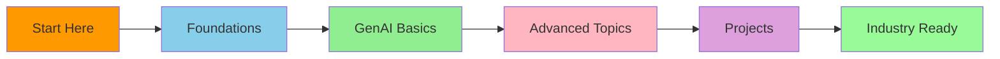
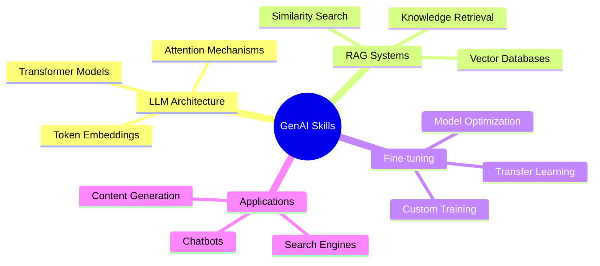

<div align="center">

 GenAI_DayZero
<h3>
  <i>Where AI Knowledge Grows From Zero to Hero</i>
</h3>


# 🤖 GenAI_DayZero

> Embark on a transformative journey into the world of Generative AI, where we turn complex concepts into actionable knowledge.

<div align="center">

[](https://github.com/ssbaraar/GenAI_DayZero/stargazers)
[](https://github.com/ssbaraar/GenAI_DayZero/network/members)
[](https://www.python.org/)
[](LICENSE)
[](CONTRIBUTING.md)


</div>

## 🌟 Why This Repository?

<div align="center">
  <table>
    <tr>
      <td align="center">🔥 Trending</td>
      <td align="center">💼 In-Demand</td>
      <td align="center">🚀 Future-Ready</td>
    </tr>
    <tr>
      <td>GenAI is revolutionizing industries</td>
      <td>Companies are actively hiring AI experts</td>
      <td>Shape the future of technology</td>
    </tr>
  </table>
</div>

## 🎯 Why Learn These Technologies?

### Large Language Models (LLMs) 🧠
- **Industry Impact**: Powering next-gen applications in customer service, content creation, and code generation
- **Market Growth**: The LLM market is projected to reach $36B by 2025
- **Applications**: 
  - Automated customer support
  - Content generation at scale
  - Code assistance and documentation
  - Language translation and localization

### Retrieval Augmented Generation (RAG) 📚
- **Why Important**:
  - Reduces hallucinations in AI responses
  - Enables real-time knowledge updates
  - Maintains data privacy and control
- **Use Cases**:
  - Enterprise knowledge bases
  - Legal document analysis
  - Medical research assistance
  - Educational content creation

### Vector Databases (AstraDB) 🎯
- **Key Benefits**:
  - Efficient similarity search
  - Scalable data storage
  - Real-time processing
- **Applications**:
  - Recommendation systems
  - Image and text search
  - Fraud detection
  - Pattern recognition

<div align="center">
  
</div>

## 🎓 Learning Journey



<div align="center">
  
</div>

## 🛠️ Technologies You'll Master

<div align="center">
  <table>
    <tr>
      <td align="center"></td>
      <td align="center"></td>
      <td align="center"></td>
    </tr>
    <tr>
      <td align="center"></td>
      <td align="center"></td>
      <td align="center"></td>
    </tr>
  </table>
</div>

## 🎯 Learning Outcomes



## 🚀 Getting Started

```bash
# Clone the repository
git clone https://github.com/ssbaraar/GenAI_DayZero.git

# Navigate to the project directory
cd GenAI_DayZero

# Create virtual environment
python -m venv venv
source venv/bin/activate  # On Windows: venv\Scripts\activate

# Install required packages
pip install -r requirements.txt

# Start your learning journey!
jupyter notebook
```

## 💻 Prerequisites

<div align="center">
  <table>
    <tr>
      <td align="center">🐍</td>
      <td align="center">🧮</td>
      <td align="center">💻</td>
      <td align="center">🧠</td>
    </tr>
    <tr>
      <td>Python 3.8+</td>
      <td>Basic Math</td>
      <td>Git & GitHub</td>
      <td>Eagerness to Learn</td>
    </tr>
  </table>
</div>

## 🤝 Join Our Community

<div align="center">
  <a href="https://discord.gg/your-server">
    
  </a>
  <a href="https://t.me/your-channel">
    
  </a>
</div>

## 👨‍💻 About the Author

<div align="center">
  
  
  AI Engineer | Full Stack Developer | Cloud Enthusiast
  
  <a href="https://www.linkedin.com/in/ssbaraar/">
    
  </a>
  <a href="mailto:ssbaraar02@gmail.com">
    
  </a>
  <a href="https://twitter.com/sreesha_baraar">
    
  </a>
</div>

<div align="center">
  
  
  [](https://git.io/typing-svg)
  
  
</div>

---

<div align="center">
  Made with ❤️ by <a href="https://github.com/ssbaraar">Sreesha Braar</a>
  
  
</div>
