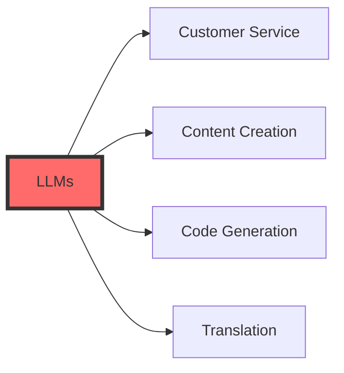
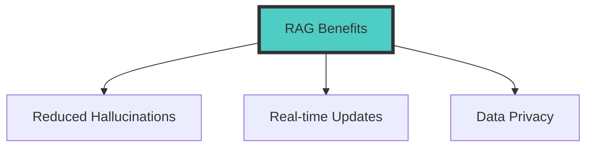
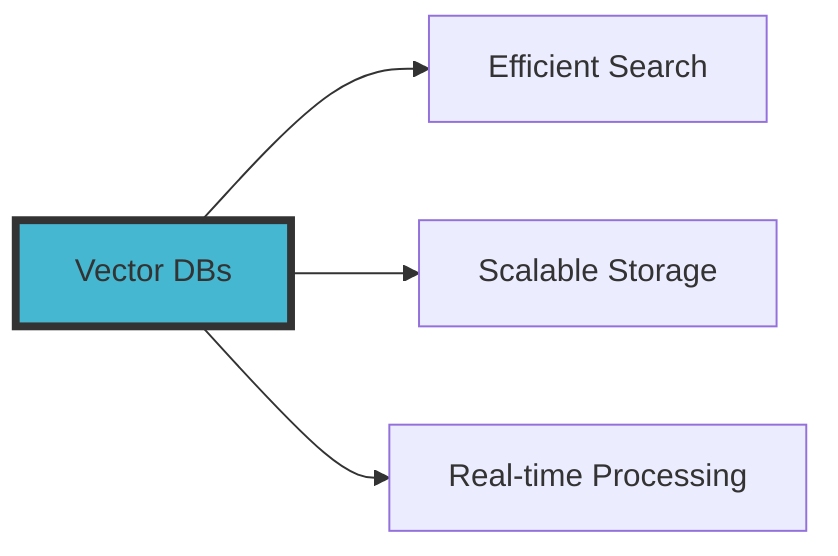

<div align="center">

<h3>
  <i>Where AI Knowledge Grows From Zero to Hero</i>
</h3>

</div>

# 🤖 GenAI_DayZero

> Embark on a transformative journey into the world of Generative AI, where we turn complex concepts into actionable knowledge.

<div align="center">

[](https://github.com/ssbaraar/GenAI_DayZero/stargazers)
[](https://github.com/ssbaraar/GenAI_DayZero/network/members)
[](https://www.python.org/)
[](LICENSE)
[](CONTRIBUTING.md)


</div>

## 🌟 Why This Repository?

<div align="center">
  <table>
    <tr>
      <td align="center">🔥 Trending</td>
      <td align="center">💼 In-Demand</td>
      <td align="center">🚀 Future-Ready</td>
    </tr>
    <tr>
      <td>GenAI is revolutionizing industries</td>
      <td>Companies are actively hiring AI experts</td>
      <td>Shape the future of technology</td>
    </tr>
  </table>
</div>

## 🎯 Why Learn These Technologies?
<div align="center">
  
  <h2>🚀 Core Technologies</h2>
  
</div>

<details>
<summary><h3>🧠 Large Language Models (LLMs)</h3></summary>

<div align="center">
  
</div>

### 🎯 Industry Impact


### 🔥 Key Applications
| Application | Impact |
|------------|---------|
| 🤖 Customer Support | Automated 24/7 assistance |
| ✍️ Content Creation | Scale content production |
| 💻 Code Assistance | Accelerate development |
| 🌍 Translation | Break language barriers |

</details>

<details>
<summary><h3>📚 Retrieval Augmented Generation (RAG)</h3></summary>

<div align="center">
  
</div>

### 🌟 Why RAG Matters


### 💡 Use Cases
| Domain | Application |
|--------|-------------|
| 🏢 Enterprise | Knowledge Management |
| ⚖️ Legal | Document Analysis |
| 🏥 Medical | Research Assistance |
| 📚 Education | Content Creation |

</details>

<details>
<summary><h3>🎯 Vector Databases</h3></summary>

<div align="center">
  
</div>

### ⚡ Key Benefits


### 🔍 Applications
| Use Case | Impact |
|----------|---------|
| 🎯 Recommendations | Personalized Experience |
| 🖼️ Image Search | Visual Similarity |
| 🛡️ Fraud Detection | Pattern Recognition |
| 📊 Analytics | Real-time Insights |

</details>

<div align="center">
  
</div>

<div align="center">
  
</div>

## 🎓 Learning Journey


<div align="center">
  
</div>

## 🛠️ Technologies You'll Master

<div align="center">
  <table>
    <tr>
      <td align="center"></td>
      <td align="center"></td>
      <td align="center"></td>
    </tr>
    <tr>
      <td align="center"></td>
      <td align="center"></td>
      <td align="center"></td>
    </tr>
  </table>
</div>

## 🎯 Learning Outcomes


## 🚀 Getting Started

```bash
# Clone the repository
git clone https://github.com/ssbaraar/GenAI_DayZero.git

# Navigate to the project directory
cd GenAI_DayZero

# Create virtual environment
python -m venv venv
source venv/bin/activate  # On Windows: venv\Scripts\activate

# Install required packages
pip install -r requirements.txt

# Start your learning journey!
jupyter notebook
```

## 💻 Prerequisites

<div align="center">
  <table>
    <tr>
      <td align="center">🐍</td>
      <td align="center">🧮</td>
      <td align="center">💻</td>
      <td align="center">🧠</td>
    </tr>
    <tr>
      <td>Python 3.8+</td>
      <td>Basic Math</td>
      <td>Git & GitHub</td>
      <td>Eagerness to Learn</td>
    </tr>
  </table>
</div>

## 🤝 Join Our Community

<div align="center">
  <a href="https://discord.gg/your-server">
    
  </a>
  <a href="https://t.me/your-channel">
    
  </a>
</div>

## 👨‍💻 About the Author

<div align="center">
  
  
  AI Engineer | Full Stack Developer | Cloud Enthusiast
  
  <a href="https://www.linkedin.com/in/ssbaraar/">
    
  </a>
  <a href="mailto:ssbaraar02@gmail.com">
    
  </a>
  <a href="https://twitter.com/sreesha_baraar">
    
  </a>
</div>

<div align="center">
  
  
  [](https://git.io/typing-svg)
  
  
</div>

---

<div align="center">
  Made with ❤️ by <a href="https://github.com/ssbaraar">Sreesha Braar</a>
  
  
</div>
